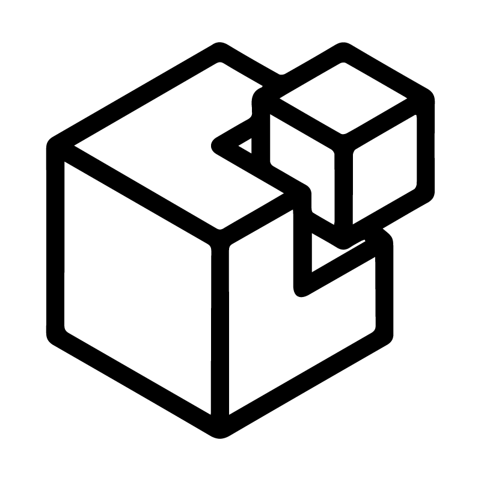
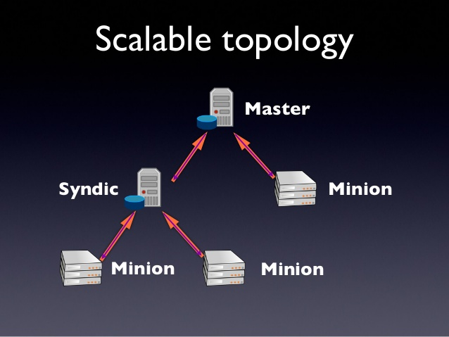
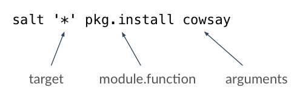

class: center, middle

<div align="center"></div>
# Dive into SaltStack

An introduction from a beginner to the main features of SaltStack

## First SaltStack Netherlands Meetup

(Amsterdam, April 2016)

---
class: center, middle
# Who I am

Matteo Piccinini ( a.k.a. l0aCk3r)

Salt absolute beginner :)

GNU/Linux, FOSS and Python passionate

Support and Deployment Engineer, Bright Computing B.V.

@loacker42

https://www.linkedin.com/in/piccininimatteo

---
name: agenda

# Agenda

1. Introduction
2. Main component
3. Topology
4. Communication mechanism
5. Installation options
6. salt-key
7. Remote execution
8. Targeting
9. Grains
10. Demo remote execution modules and grains
11. States
12. Pillar
13. Salt mine
14. Formulas
15. Demo states
16. salt-cloud
17. salt-ssh
18. Demo salt-cloud and salt-ssh


---
# Introduction

[Quote from wikipedia:](https://www.google.com)

SaltStack platform or Salt is a Python-based open source configuration management 
software and remote execution engine.

[From SaltStack documentation:](https://docs.saltstack.com/en/latest/)

SaltStack is a revolutionary approach to infrastructure management that 
replaces complexity with speed.

Is easy enough to get running in minutes, scalable enough to manage tens of 
thousands of servers, and fast enough to communicate with those servers in seconds.

Salt delivers a dynamic communication bus for infrastructures that can 
be used for orchestration, remote execution, configuration management and much more.

Salt is developed under the Apache 2.0 license.


---
# Main component

- salt-master
- salt-minion
- salt-syndic
- salt-proxy
- salt-virt
- salt-cloud
- salt-ssh
- Execution Modules
- Formulas (States)
- Grains
- Pillar
- Runners
- Returners
- Reactor


---
# Topology

<div align="center"></div>

.footnote[.red.bold[*] http://tinyurl.com/zvym777]


---
# Communication mechanism

Salt is based on a powerful, asynchronous, network topology using ZeroMQ.

The Salt Master runs 2 network services. 

 1. First is the ZeroMQ PUB system. Port 4505
 2. Second is the ZeroMQ REP system. Port 4506


The commands sent out via the salt client are broadcast out to the minions via ZeroMQ PUB/SUB.
This is done by allowing the minions to maintain a connection back to the Salt Master and then 
all connections are informed to download the command data at once.

The PUB/SUB system is a one way communication.

Salt uses public keys for authentication with the master daemon, then uses faster AES encryption for payload communication.

Salt takes advantage of communication via msgpack, enabling fast and light network traffic.


---
# Installation options

- SaltStack repository (yum, apt etc...)
- Community maintained repository (epel etc...)
- Salt Bootstrap (BaSH script)
- Python package installers (pip, easy_install etc...)

Supported OS:

 - Arch Linux
 - Debian GNU/Linux / Raspbian
 - Fedora
 - FreeBSD
 - Gentoo
 - OpenBSD
 - OS X
 - RHEL / CentOS / Scientific Linux / Amazon Linux / Oracle Linux
 - Solaris
 - Ubuntu
 - Windows
 - SUSE


---
# salt-key

Executes simple management of Salt server public keys used for authentication.

On initial connection, a Salt minion sends its public key to the Salt master.
This key must be accepted using the salt-key command on the Salt master.

 - **unaccepted**: key is waiting to be accepted.
 - **accepted**: key was accepted and the minion can communicate with the Salt master.
 - **rejected**: key was rejected using the salt-key command. Minion does not receive any communication from the Salt master.
 - **denied**: key was rejected automatically by the Salt master.

```bash
[root@salt ~]# salt-key -L
Accepted Keys:
minion1
salt
Denied Keys:
Unaccepted Keys:
minion2
Rejected Keys:
```


---
# Remote execution

The remote execution capabilities are provided by execution modules.
Execution modules are sets of related functions that perform work on minions.

The idea behind execution modules is to provide a concise mechanism for executing commands without having to "shell out" 

Execute commands and query data on remote nodes, either individually or by arbitrary selection criteria. 

Salt comes with a decent selection of [builtin](https://docs.saltstack.com/en/latest/salt-modindex.html) execution modules to provide out-of-the-box functionality. 
It is possible to extend the library of commands, writing a custom module or including a community-written module.


```bash
salt '*' cmd.run 'ls -l /root'
salt -L minion2,minion3 disk.usage
salt minion1 disk.percent /
salt -G role:webserver network.interface_ip eth0
salt \* sys.doc
salt \* sys.doc pkg
```


---
# Targeting

Targeting is how you select Salt minions when running commands, applying configurations,
and when doing almost anything else in SaltStack.

<div align="center"></div>

```bash
salt '*' service.restart salt-minion
salt 'minion1' pkg.install screen
salt -G 'os:CentOS' test.ping
salt -E 'minion[1-3]' test.ping
salt -L 'minion1,minion2' network.interface_ip eth0
salt -C 'G@role:webserver and minion* or S@192.168.33.*' test.ping
```


---
# Grains
Grains are static information SaltStack collects about the underlying managed system.
SaltStack collects grains for the operating system, domain name, IP address, kernel,
OS type, memory, and many other system properties.

To add a custom grains placing them in the /etc/salt/grains.

```bash
salt '*' grains.ls
salt '*' grains.items
salt '*' grains.get ip4_interfaces
salt \* grains.get os
salt minion1 grains.setval role webserver
```

---
class: center, middle
# Demo remote execution modules and grains


---
# States (Configuration Management)

The core of the Salt State system is the SLS, or SaLt State file.
The SLS is a representation of the state in which a system should be in.

An SLS file contains one or more state declaration.
A state declaration lists the state function calls and arguments that make
up a state. Each state declaration starts with a unique ID.

SLS files are just dictionaries, lists, strings, and numbers.

By default Salt represents the SLS data in what is one of the simplest 
serialization formats available - YAML.

The yaml_jinja renderer (default) will first pass the template through
the Jinja2 templating system, and then through the YAML parser.

Other renderers available are yaml_mako and yaml_wempy, the pure Python or py, pydsl & pyobjects renderers.

```bash
salt '*' state.highstate
salt minion1 state.sls apache.sls
```


---
# SLS example

```yaml
apache:
  pkg.installed:
    
    - name: httpd
    
  service.running:
    
    - name: httpd
    
    - watch:
      - pkg: apache
      - file: /etc/httpd/conf/httpd.conf

/etc/httpd/conf/httpd.conf:
  file.managed:
    - source: salt://apache/httpd.conf
    - user: root
    - group: root
    - mode: 644
```


---
# Pillar

Pillars are tree-like structures of data defined on the Salt Master and passed
through to minions. They allow confidential, targeted data to be securely sent
only to the relevant minion.

Pillar data is useful for:

 - **Highly Sensitive Data**: cryptographic keys and passwords.
 - **Minion Configuration**: Minion modules such as the execution modules, states, and returners.
 - **Variables**: Variables which need to be assigned to specific minions or groups of minions.
 - **Arbitrary Data**: Pillar can contain any basic data structure in dictionary format.

```bash
salt '*' pillar.items
salt '*' pillar.get mine_functions
```
```bash
apache:
  pkg.installed:
    - name: {{ salt['pillar.get']('pkgs:apache', 'httpd') }}
```


---
# Salt mine

The Salt Mine is used to collect arbitrary data from Minions and store it on the Master.
This data is then made available to all Minions.

Mine data is gathered on the Minion and sent back to the Master where only the most recent data is maintained.


**Mine vs Grains**

Mine data is designed to be much more up-to-date than grain data.
Mines are designed to replace slow peer publishing calls when Minions need data from other Minions.

Mine are updated on minion startup and refreshed on a fixed interval managed by the scheduler

```bash
salt \* mine.update
salt \* mine.get 'role:webserver' network.ip_addrs expr_form=grain
```

---
# Formulas

A collection of state and pillar files that configure an application or system component.
Most Formulas are made up of several states spread across multiple state files.


---
```bash
/opt/salt/
|-- pillar
|   |-- apache
|   |   `-- init.sls
|   `-- top.sls
| 
`-- states
    |-- apache
    |   |-- conf.sls
    |   |-- files
    |   |   |-- centos
    |   |   |   `-- httpd.conf.jinja
    |   |   |-- index.html.jinja
    |   |   `-- ubuntu
    |   |       `-- apache2.conf.jinja
    |   |-- init.sls
    |   `-- map.jinja
    |-- haproxy
    |   |-- conf.sls
    |   |-- files
    |   |   |-- centos
    |   |   |   `-- haproxy.cfg.jinja
    |   |   `-- ubuntu
    |   |       `-- haproxy.cfg.jinja
    |   |-- init.sls
    |   `-- map.jinja
    |-- top.sls
```


---
class: center, middle
# Demo states


---
# salt-cloud

Salt Cloud provides a powerful interface to interact with cloud hosts.
Virtual machines are automatically connected to a Salt master after creation.

Some of the supported cloud providers and cloud/virtualization platform:

 - Scaleway
 - Rackspace
 - Amazon AWS
 - Linode
 - Joyent Cloud
 - GoGrid
 - OpenStack
 - DigitalOcean
 - Parallels
 - Proxmox
 - LXC
 - Saltify

```bash
salt-cloud -p stack512 web1
salt-cloud -m mapfile -P --no-deploy 
```


---
# salt-ssh

Execute salt commands and states over ssh without installing a salt-minion.

The Salt SSH system offers an SSH-based alternative that does not require ZeroMQ and a remote agent.
All communication with Salt SSH is executed via SSH it is substantially slower than standard Salt with ZeroMQ or RAET.

Python is required on the remote system (unless using the -r option to send raw ssh commands)

```bash
salt-ssh '*' test.ping
salt-ssh '*' state.highstate
```

---
class: center, middle
# Demo salt-cloud and salt-ssh

---
# Topics for next talks

 - Salt event bus
 - Reactor
 - Beacon
 - Scheduler
 - Returners
 - Extenal job cache
 - salt-proxy
 - salt-virt
 - Scaling salt (syndic, HA)
 - SPM
 - Custom modules and grains


---
# How to contribute

 - **Contributing guide**:

   https://docs.saltstack.com/en/latest/topics/development/contributing.html

 - **Development tutorial**:

   https://docs.saltstack.com/en/latest/topics/development/tutorial.html

 - **Developer guide**:

   https://docs.saltstack.com/en/develop/topics/development/index.html


---
class: center, middle

# Thanks!

Slides on github:

http://github.com/loacker/saltstack_meetup_april_2016


